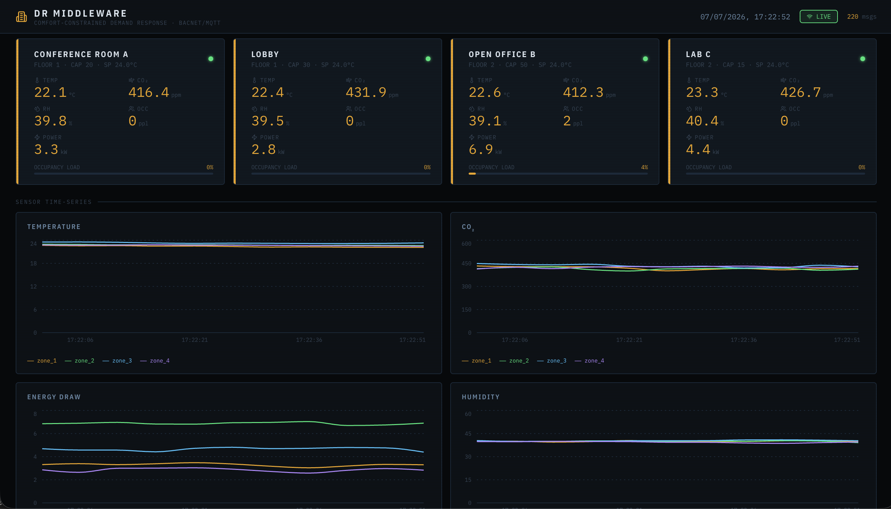

# smart-building-iot-pipeline


> **Comfort-constrained, occupancy-aware demand response middleware for MQTT-instrumented commercial buildings.**
>
> Small and mid-size commercial buildings want to participate in utility Demand Response programs — but most can't. Participating requires automation that can shed load within minutes of a DR signal. Full building management systems (Siemens, Johnson Controls) solve this for $50K–$500K. This project solves it for the cost of a $6/month cloud droplet and cheap MQTT sensors.

---

## The Problem

Utility companies like SCE run Demand Response programs that pay buildings to automatically reduce electricity use during peak grid stress. Participating requires automation: receive a signal, identify which zones can safely reduce load, adjust HVAC setpoints, report savings back. Large buildings have proprietary BMS platforms that do this. Small and mid-size buildings — offices, labs, clinics — have nothing but a facilities manager and a thermostat.

**This project is the missing middleware layer.**

---

## Architecture

```
┌──────────────────────────────────────────────────────────────────┐
│                         Docker Network                           │
│                                                                  │
│  ┌──────────────┐  MQTT/pub   ┌──────────────┐                  │
│  │   Sensor     │──────────▶  │  Mosquitto   │                  │
│  │  Simulator   │             │  MQTT :1883  │                  │
│  │  (4 zones)   │◀ setpoints ─└──────┬───────┘                  │
│  │  physics     │  from BACnet       │ subscribe                │
│  │  feedback    │            ┌───────▼────────┐                 │
│  └──────────────┘            │ FastAPI Backend │                 │
│                              │                │                 │
│  ┌──────────────┐  BACnet    │ • MQTT bridge  │                 │
│  │  Mock BACnet │◀──write────│ • ML predictor │                 │
│  │   Device     │            │ • DR engine    │                 │
│  │ (AnalogValue │────read───▶│ • Comfort check│                 │
│  │  per zone)   │  confirm   │ • Audit logger │                 │
│  └──────────────┘            │ • WS /ws       │                 │
│                              └───────┬────────┘                 │
│                                      │ asyncpg                  │
│                                      ▼                          │
│                           ┌──────────────────┐                  │
│                           │   TimescaleDB    │                  │
│                           │ sensor_readings  │                  │
│                           │ dr_events        │                  │
│                           │ setpoint_log     │                  │
│                           │ audit_trail      │                  │
│                           │ occupancy_baselines                 │
│                           └──────────────────┘                  │
│                                                                  │
│  ┌───────────────────────────────────────────┐                  │
│  │         React Dashboard  :5173            │                  │
│  │  Zone cards · Charts · DR Control Panel   │                  │
│  │  Comfort status · Energy saved · Audit    │                  │
│  └───────────────────────────────────────────┘                  │
└──────────────────────────────────────────────────────────────────┘
```

**The closed control loop — what makes this a real system, not a dashboard:**

```
Sensor reading → TimescaleDB → ML predicts occupancy (next 30 min)
                                        ↓
                     DR webhook arrives (target: shed 8 kW)
                                        ↓
                     Optimizer ranks zones by occupancy ratio
                     Greedy allocation within comfort bounds
                                        ↓
                     BACnet WriteProperty → cooling setpoint +2°C
                                        ↓
                     Simulator reads new setpoint from BACnet device
                     Temperature drifts up · energy_kw drops
                     New MQTT reading published
                                        ↓
                     Dashboard: kW shed live · comfort maintained · audit logged
                     After duration: setpoints restored · kWh avoided recorded
```

---

## Tech Stack

| Layer | Technology | Why |
|---|---|---|
| Sensor simulation | Python + paho-mqtt | Physics model: occupancy-correlated temp, CO₂, energy. Reads BACnet setpoints and adjusts output (closed loop) |
| Message broker | Mosquitto (Docker) | Industry-standard MQTT — same protocol used in real building IoT gateways |
| Time-series DB | TimescaleDB (PostgreSQL 16) | Hypertables, continuous aggregates, retention policies — built for IoT ingest |
| Backend | FastAPI + asyncpg | Async I/O — MQTT bridge, ML predictor, DR engine, BACnet client, WebSocket in one process |
| BACnet layer | bacpypes3 object model + REST gateway | AnalogValue objects per zone, WriteProperty/ReadProperty, comfort-bound enforcement at device layer |
| Frontend | React 18 + Recharts | Live WebSocket charts, DR control panel, audit log |
| Containerization | Docker Compose | 6-service stack, single command startup |
| CI/CD | GitHub Actions | Build → test → Docker image on every push |

---

## Simulated Sensors

| Sensor | Unit | Physics model |
|---|---|---|
| `temperature` | °C | Base setpoint + outdoor sine wave (±6°C diurnal) + occupancy heat load + thermal inertia per zone |
| `humidity` | % | Base 40% rising with occupancy (breath/perspiration load) |
| `co2` | ppm | 420 ppm baseline + 20 ppm/person − HVAC dilution; ASHRAE 62.1 threshold 1000 ppm |
| `occupancy` | persons | Business-hours schedule (7am–8pm) with lunch dip, gradual drift, per-zone capacity |
| `energy_kw` | kW | Base load + lighting (occupancy-dimmed) + equipment + HVAC cooling demand vs outdoor temp |

**Feedback loop:** The simulator polls the BACnet device every 3 ticks (15s). When the DR engine raises a cooling setpoint, HVAC cooling demand (`max(0, outdoor_temp − setpoint)`) drops → energy_kw decreases in subsequent readings. This is validated — see [Test Results](#test-results).

Four zones: **Conference Room A** (cap 20, 800 sqft), **Open Office B** (cap 50, 2400 sqft), **Lab C** (cap 15, 600 sqft), **Lobby** (cap 30, 1200 sqft).

---

## Demand Response Engine

**Algorithm:** Comfort-constrained greedy optimizer.

```
Input:  target_kw_reduction, duration_minutes, comfort_bounds

1. Rank zones by (current_occupancy / capacity) ascending
   → shed from emptiest zones first, protect occupied zones

2. For each zone (emptiest first):
   a. Check comfort bounds — can we raise setpoint without violation?
   b. Compute max_sheddable_kW within bounds
   c. Allocate greedily until target met

3. Issue BACnet WriteProperty per zone
   → cooling setpoint raised by computed delta (max 3°C per event)

4. Log DR event + per-zone actions to TimescaleDB

5. After duration_minutes:
   → measure actual savings (35s rolling average from TimescaleDB)
   → restore all setpoints via BACnet reset
   → update DR event record with actual_kw_reduction, kwh_avoided
```

**Comfort constraints enforced at two independent layers:**

| Layer | Constraint | Source |
|---|---|---|
| DR optimizer | Won't plan a setpoint raise if it would breach bounds | `dr/comfort.py` |
| BACnet device | Rejects any write outside 20–28°C at the device layer | `bacnet/device.py` |

Hard bounds (ASHRAE 55 / 62.1): Temperature 18–26°C · CO₂ ≤ 1000 ppm · Humidity 30–65%.

---

## ML Occupancy Predictor

Two-component model — lightweight enough for sub-second control loop inference.

**Component 1 — Time-of-day baseline:**
Hourly occupancy averages per zone × weekday, learned from the last 14 days of readings in TimescaleDB. Refreshed every 30 minutes as a background async task.

**Component 2 — Exponential weighted average:**
Rolling signal on the last 6 occupancy readings per zone (α = 0.4). Captures real-time deviations from schedule.

**Blend:** `prediction = 0.55 × baseline(target_hour) + 0.45 × EWA(recent)`

Output per zone: `predicted_occupancy`, `occupancy_ratio`, `is_low_occupancy` (ratio < 0.30), `confidence` (0–1 based on sample count).

---

## Database Schema

```sql
-- Raw IoT hypertable (TimescaleDB)
sensor_readings     (zone_id, sensor_type, value, unit, timestamp)
                    → 1-day chunks, 30-day retention, continuous 5-min aggregate

-- ML baselines
occupancy_baselines (zone_id, hour_of_day, day_of_week, avg_occupancy, sample_count)

-- BACnet audit
setpoint_log        (zone_id, setpoint_type, value_before, value_after, source, dr_event_id)

-- DR lifecycle
dr_events           (id, status, target_kw_reduction, actual_kw_reduction, kwh_avoided,
                     comfort_maintained, zones_affected, started_at, completed_at)
dr_zone_actions     (dr_event_id, zone_id, predicted_occupancy, kw_before, setpoint_delta_c)

-- Human-readable log
audit_trail         (event_type, severity, zone_id, dr_event_id, message, metadata)
```

---

## API Reference

| Method | Endpoint | Description |
|---|---|---|
| GET | `/health` | Service + DB health check |
| GET | `/zones/` | Zone metadata |
| GET | `/zones/comfort` | Live ASHRAE comfort status per zone |
| GET | `/zones/setpoints` | Current BACnet setpoints |
| GET | `/readings/latest` | Most recent reading per zone × sensor |
| GET | `/readings/{zone_id}` | Time-series history (`sensor_type`, `hours`, `limit`) |
| GET | `/readings/building/summary` | Cross-zone aggregates for last N minutes |
| **POST** | **`/dr/event`** | **Trigger a demand response event** |
| GET | `/dr/events` | DR event history |
| GET | `/dr/events/{id}` | Full event detail + per-zone actions |
| GET | `/dr/predict` | ML occupancy forecast for all zones |
| GET | `/audit/` | System audit trail |
| GET | `/audit/setpoints` | BACnet setpoint write log |
| WS | `/ws` | Live sensor stream (JSON frames) |

Interactive docs: **`/docs`** (Swagger UI) · **`/redoc`**

---

## Running Locally

### Prerequisites
- Docker + Docker Compose v2

```bash
git clone https://github.com/rahulsp2504/smart-building-iot-pipeline.git
cd smart-building-iot-pipeline

cat > .env << 'EOF'
POSTGRES_USER=postgres
POSTGRES_PASSWORD=postgres
POSTGRES_DB=smartbuilding
MQTT_HOST=mosquitto
MQTT_PORT=1883
BACNET_URL=http://bacnet:8001
ALLOWED_ORIGINS=http://localhost:5173,http://localhost:80
PUBLISH_INTERVAL=5
VITE_API_URL=http://localhost:8000
VITE_WS_URL=ws://localhost:8000/ws
EOF

docker compose up --build
```

| Service | URL |
|---|---|
| Live dashboard | http://localhost:5173 |
| API + Swagger UI | http://localhost:8000/docs |
| BACnet device | http://localhost:8001/docs |
| TimescaleDB | postgresql://localhost:5432/smartbuilding |

**Trigger a DR event from the command line:**
```bash
curl -X POST http://localhost:8000/dr/event \
  -H "Content-Type: application/json" \
  -d '{"target_kw_reduction": 8, "duration_minutes": 5, "triggered_by": "api"}'
```

Watch setpoints change on the BACnet device, energy drop in the dashboard, and the event complete with `kwh_avoided` populated after 5 minutes.

## Dashboard



The live control dashboard shows real-time WebSocket-streamed data across all 4 zones:

- **Zone cards** — per-zone temperature, CO₂, humidity, occupancy, energy draw, and ASHRAE comfort status with warning indicators
- **Sensor charts** — rolling time-series (temperature, CO₂, energy, humidity) with ASHRAE 62.1 reference lines
- **DR Control Panel** — trigger demand response events, see the per-zone shedding plan, watch projected kW live
- **Occupancy Forecast** — ML predictions 30 minutes ahead per zone, flagging DR candidates
- **Audit Log** — every system event with severity, timestamp, and dr_event_id linkage
- **Building Summary** — total power draw and cumulative kWh avoided counter

---

## Test Results

All 7 validation scenarios pass on the live stack. Results recorded against real running containers — no mocked output.

| # | Scenario | Status | Result |
|---|---|---|---|
| 1 | Pipeline health check | ✅ Pass | 20 live readings (4 zones × 5 sensors), all services connected, BACnet setpoints at default 24.0°C |
| 2 | ML occupancy predictions | ✅ Pass | Predicted occupancy, ratio, confidence, and DR candidacy returned for all 4 zones |
| 3 | Standard DR event | ✅ Pass | Setpoints changed, event completed, `actual_kw_reduction: 13.18 kW`, `kwh_avoided: 1.0984`, `comfort_maintained: true` |
| 4 | Comfort constraint enforcement | ✅ Pass | BACnet rejected 29°C write (`VALUE_OUT_OF_RANGE`). 100 kW impossible target capped at 9.8 kW projected with `target_met: false` |
| 5 | Closed-loop feedback | ✅ Pass | zone_2 energy: 6.85 kW → 6.63 kW after cooling setpoint raised 24°C → 27°C via BACnet |
| 6 | Audit trail | ✅ Pass | Every DR trigger, zone action, and completion logged with `dr_event_id` linkage |
| 7 | TimescaleDB persistence | ✅ Pass | 2,700+ samples per sensor type in 60-min window; 13,900+ total data points |

### Scenario 1 — Pipeline health

```bash
curl -s http://localhost:8000/health | python3 -m json.tool
```
```json
{
    "status": "ok",
    "database": "connected",
    "version": "1.0.0"
}
```

20 readings across 4 zones, all BACnet setpoints initialized at 24.0°C.

---

### Scenario 2 — ML occupancy predictions

```bash
curl -s "http://localhost:8000/dr/predict?lookahead_minutes=30" | python3 -m json.tool
```
```json
{
    "zone_1": {
        "predicted_occupancy": 1.0,
        "occupancy_ratio": 0.05,
        "is_low_occupancy": true,
        "confidence": 0.3,
        "capacity": 20,
        "baseline_used": 1.0,
        "recent_signal": 1.0
    },
    "zone_2": {
        "predicted_occupancy": 1.4,
        "occupancy_ratio": 0.028,
        "is_low_occupancy": true,
        "confidence": 0.3,
        "capacity": 50
    }
}
```

Zones flagged `is_low_occupancy: true` are DR candidates. Confidence grows toward 1.0 as historical baselines accumulate.

---

### Scenario 3 — Standard DR event (core demo)

```bash
curl -X POST http://localhost:8000/dr/event \
  -H "Content-Type: application/json" \
  -d '{"target_kw_reduction": 8, "duration_minutes": 5, "triggered_by": "api"}'
```
```json
{
    "event_id": "e9d2b193-82fe-4ef1-a08c-3fa3c71bd2ff",
    "status": "active",
    "target_kw": 8.0,
    "projected_kw_shed": 8.0,
    "target_met": true,
    "zones_affected": ["zone_3", "zone_2", "zone_4"],
    "zone_actions": [
        {"zone_id": "zone_3", "zone_name": "Lab C",        "occupancy_ratio": 0.028, "setpoint_delta_c": 2.0, "kw_shed": 1.4},
        {"zone_id": "zone_2", "zone_name": "Open Office B", "occupancy_ratio": 0.029, "setpoint_delta_c": 2.0, "kw_shed": 4.4},
        {"zone_id": "zone_4", "zone_name": "Lobby",         "occupancy_ratio": 0.043, "setpoint_delta_c": 2.0, "kw_shed": 2.2},
        {"zone_id": "zone_1", "zone_name": "Conference A",  "occupancy_ratio": 0.049, "setpoint_delta_c": 0.0, "skip_reason": "target already met"}
    ]
}
```

After 5 minutes — event record:
```json
{
    "status": "completed",
    "target_kw_reduction": 8.0,
    "actual_kw_reduction": 13.181,
    "kwh_avoided": 1.0984,
    "comfort_maintained": true,
    "started_at": "2026-05-29T01:00:35.025345+00:00",
    "completed_at": "2026-05-29T01:05:35.036024+00:00"
}
```

The optimizer shed from the 3 lowest-occupancy zones first, leaving Conference Room A untouched (target already met). Setpoints were restored after 5 minutes.

---

### Scenario 4 — Comfort constraint enforcement

**Direct BACnet write — 29°C above hard ceiling:**
```bash
curl -X POST http://localhost:8001/write \
  -H "Content-Type: application/json" \
  -d '{"object_instance": 1, "value": 29.0, "written_by": "test"}'
```
```json
{
    "detail": "Cooling setpoint 29.0°C rejected: must be 20.0–28.0°C (BACnet error: VALUE_OUT_OF_RANGE)"
}
```

**Impossible 100 kW DR target:**
```json
{
    "target_kw": 100.0,
    "projected_kw_shed": 9.8,
    "target_met": false
}
```

Comfort bounds enforced independently at the BACnet device layer and the DR optimizer layer.

---

### Scenario 5 — Closed-loop feedback

Manually raise zone_2 cooling setpoint via BACnet, then measure energy response.

```bash
# Baseline
curl -s "http://localhost:8000/readings/zone_2?sensor_type=energy_kw&limit=1"
# → value: 6.851 kW

# Raise setpoint: 24°C → 27°C
curl -X POST http://localhost:8001/write \
  -H "Content-Type: application/json" \
  -d '{"object_instance": 11, "value": 27.0, "written_by": "feedback_test"}'

# Wait 35 seconds (7 simulator ticks)
sleep 35

# After
curl -s "http://localhost:8000/readings/zone_2?sensor_type=energy_kw&limit=1"
# → value: 6.638 kW
```

**Energy: 6.851 kW → 6.638 kW** after setpoint raise. The simulator's HVAC model responds to the BACnet setpoint change, closing the control loop.

---

### Scenario 6 — Audit trail

```bash
curl -s "http://localhost:8000/audit/?limit=5" | python3 -m json.tool
```
```json
[
    {
        "event_type": "dr_completed",
        "severity": "info",
        "dr_event_id": "bb2ced33-422c-44e0-a0f5-de0acad17a9c",
        "message": "DR event bb2ced33… completed. Actual shed: 13.18 kW | kWh avoided: 1.0984 | Comfort maintained: True",
        "timestamp": "2026-05-29T01:05:35.036024+00:00"
    },
    {
        "event_type": "dr_triggered",
        "severity": "info",
        "message": "DR event bb2ced33… triggered by api. Target: 8.0 kW | Projected shed: 8.00 kW | Zones affected: 3",
        "timestamp": "2026-05-29T01:00:35.025345+00:00"
    }
]
```

Every action — trigger, zone changes, completion — is logged with `dr_event_id` linkage for utility audit compliance.

---

### Scenario 7 — TimescaleDB persistence

```bash
curl -s "http://localhost:8000/readings/building/summary?minutes=60" | python3 -m json.tool
```
```json
{
    "window_minutes": 60,
    "metrics": [
        {"sensor_type": "co2",        "avg_value": 424.85, "samples": 2783},
        {"sensor_type": "energy_kw",  "avg_value": 3.89,   "samples": 2781},
        {"sensor_type": "humidity",   "avg_value": 40.39,  "samples": 2783},
        {"sensor_type": "occupancy",  "avg_value": 0.49,   "samples": 2782},
        {"sensor_type": "temperature","avg_value": 22.72,  "samples": 2783}
    ]
}
```

13,900+ data points ingested, indexed, and aggregated in a 60-minute window across 5 sensor types and 4 zones.

---

## Project Structure

```
smart-building-iot-pipeline/
├── .github/workflows/
│   └── ci.yml                  # lint + build + Docker image on push
├── bacnet/
│   ├── device.py               # Mock BACnet IP device (AnalogValue objects, REST gateway)
│   ├── requirements.txt
│   └── Dockerfile
├── broker/
│   └── mosquitto.conf
├── db/
│   └── init.sql                # Hypertable, continuous aggregate, all 6 tables
├── simulator/
│   ├── simulator.py            # Physics model with BACnet setpoint feedback loop
│   ├── requirements.txt
│   └── Dockerfile
├── backend/
│   ├── app/
│   │   ├── main.py             # FastAPI app, lifespan, WebSocket /ws
│   │   ├── database.py         # Async SQLAlchemy engine
│   │   ├── mqtt_bridge.py      # MQTT → TimescaleDB + WS fan-out
│   │   ├── bacnet_client.py    # BACnet WriteProperty/ReadProperty client
│   │   ├── ml/
│   │   │   └── predictor.py    # Time-of-day baseline + EWA occupancy predictor
│   │   ├── dr/
│   │   │   ├── engine.py       # DR event orchestrator (trigger → BACnet → measure → restore)
│   │   │   ├── optimizer.py    # Comfort-constrained greedy shed planner
│   │   │   └── comfort.py      # ASHRAE 55/62.1 bound checker
│   │   └── routes/
│   │       └── __init__.py     # /readings, /zones, /dr, /audit endpoints
│   ├── requirements.txt
│   └── Dockerfile
├── frontend/
│   ├── src/
│   │   ├── App.jsx             # Dashboard layout
│   │   ├── components/
│   │   │   └── index.jsx       # ZoneCard, SensorChart, DRPanel, AuditLog, PredictionPanel
│   │   └── hooks/
│   │       └── useWebSocket.js # Auto-reconnecting WS with rolling history
│   ├── nginx.conf              # /api + /ws proxy to backend
│   └── Dockerfile              # Multi-stage: Vite build → Nginx
├── docker-compose.yml
└── .env.example
```

---

## Relevance to Target Roles

| Skill demonstrated | Maps to |
|---|---|
| MQTT pub/sub, QoS, topic hierarchy, BACnet object model | IoT/Building Automation SWE — Johnson Controls, Siemens, Honeywell |
| Demand response event API, comfort-constrained optimization | Energy Tech — AutoGrid, SCE, Arcadia, CalNEXT research |
| TimescaleDB hypertables, continuous aggregates, retention | Data/Backend SWE with IoT scale requirements |
| Async FastAPI, WebSocket, background task lifecycle | Backend SWE — Adobe, Google, Microsoft |
| Occupancy ML, time-series baseline + EWA blend | Bridges directly to CalPlug/TIPPERS HVAC research |
| Docker Compose, GitHub Actions CI | Any SWE role |

---

## Related Research

This project extends the architecture being developed as part of graduate research at the [Calit2 CalPlug lab](https://www.calit2.uci.edu), UC Irvine — funded by the CalNEXT Program (Southern California Edison / UC Davis). The research targets AI-driven occupancy-based HVAC control using TIPPERS IoT middleware and BACnet actuation in real commercial building deployments.

---

## License

MIT
